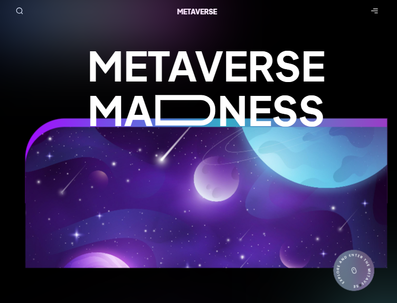

# Metaverse of Madness



Welcome to the Multiverse of Madness! This website is built using Framer Motion, Tailwind CSS, and Next.js. It provides an interactive user experience with smooth animations and responsive design.

## Getting Started

To get started with the project, follow these steps:

1. Clone the repository:

   ```bash
   git clone https://github.com/your-username/your-repo.git
   ````
2 Install dependencies:

```bash
cd meta
npm install
```

3. Start the development server:

```bash
npm run dev
```


4. Open your browser and visit http://localhost:3000 to see the website in action.

## Technologies Used
- Framer Motion: A powerful animation library for React.
- Tailwind CSS: A utility-first CSS framework for building custom designs.
- Next.js: A React framework for building server-side rendered and static websites.

## Deployment
Project was deployed to Vercel, check it out.
